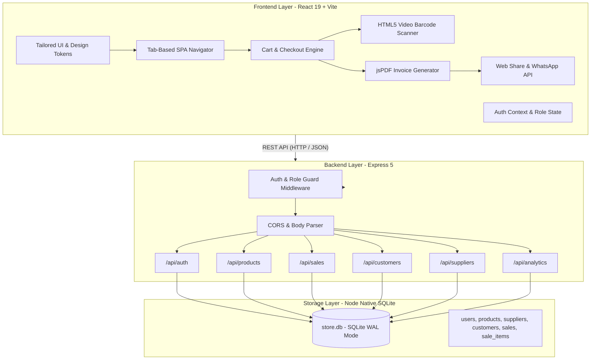
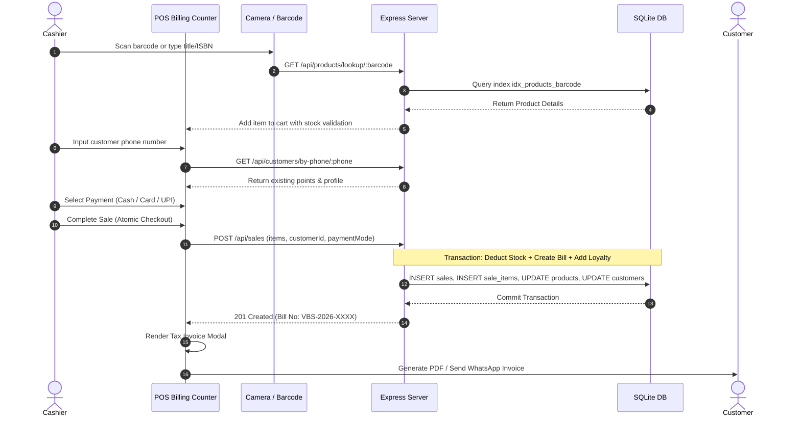
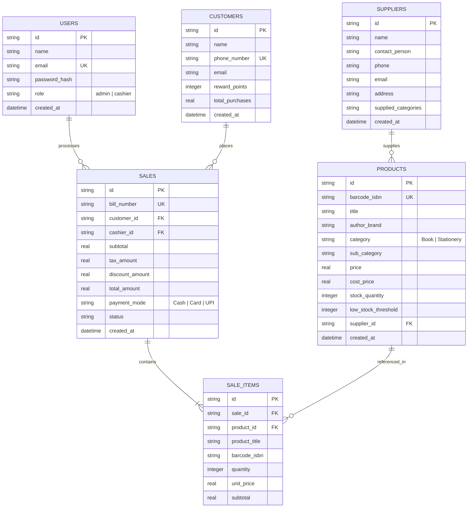

# 📚 Vijay Book Store — Management System & POS Platform
> **Enterprise-Grade Retail Management, High-Speed Point of Sale, Inventory Control & Analytics Platform**

[](https://vitejs.dev/)
[](https://react.dev/)
[](https://expressjs.com/)
[](https://www.sqlite.org/)
[](https://nodejs.org/)
[](LICENSE)

---

## 📑 Table of Contents
1. [Product Overview & Vision](#-product-overview--vision)
2. [Target Personas & Role-Based Access Control](#-target-personas--role-based-access-control)
3. [End-to-End System Architecture](#-end-to-end-system-architecture)
4. [Interactive Data Flow Diagrams](#-interactive-data-flow-diagrams)
5. [Database Architecture & Data Models](#-database-architecture--data-models)
6. [Core Functional Modules](#-core-functional-modules)
7. [API Specification & Endpoints](#-api-specification--endpoints)
8. [Design System & UI Tokens](#-design-system--ui-tokens)
9. [Getting Started & Local Setup](#-getting-started--local-setup)
10. [Production Build & Deployment](#-production-build--deployment)

---

## 🎯 Product Overview & Vision

### Problem Statement
Traditional retail bookstores and stationery shops struggle with fragmented operations: disconnected inventory management, slow checkout lines, manual barcode entry, missing customer retention tools, and zero real-time visibility into sales margins and inventory valuation.

### Solution
**Vijay Book Store Management System** is a full-stack, offline-resilient, lightning-fast retail operating system. It unifies:
- **Instant POS Billing Counter** with USB barcode scanner, optical camera scanning, and instant keyboard shortcuts.
- **Automated Inventory & Thresholds** with proactive low-stock notifications and supplier association.
- **Customer Loyalty Engine** calculating reward points per spend and applying seamless discounts.
- **Multichannel Digital Invoicing** generating downloadable GST-compliant Tax PDF invoices and 1-click WhatsApp delivery.
- **Executive Analytics Dashboard** providing inventory cost vs. retail valuation, profit margins, and daily/monthly trends.

---

## 👥 Target Personas & Role-Based Access Control

```
                             ┌──────────────────────────────┐
                             │    Authentication Gate       │
                             │  (Session / Token Validated) │
                             └──────────────┬───────────────┘
                                            │
                    ┌───────────────────────┴───────────────────────┐
                    ▼                                               ▼
     ┌────────────────────────────┐                  ┌────────────────────────────┐
     │      Store Admin / GM      │                  │   Cashier / Counter Staff  │
     ├────────────────────────────┤                  ├────────────────────────────┤
     │ • Executive Overview KPI   │                  │ • High-Speed POS Counter   │
     │ • Full Inventory (CRUD)    │                  │ • Barcode / Camera Lookup  │
     │ • Supplier Management      │                  │ • Customer Loyalty Signup  │
     │ • Financial & Tax Reports  │                  │ • Cash/Card/UPI Checkout   │
     │ • Stock Threshold Updates  │                  │ • Print / WhatsApp Bill    │
     │ • Role Switching (Testing) │                  │ • Read-Only Customer Info  │
     └────────────────────────────┘                  └────────────────────────────┘
```

---

## 🏛️ End-to-End System Architecture

The application adopts a modular client-server architecture with zero external database dependencies, utilizing Node.js's native high-performance SQLite engine in Write-Ahead Logging (WAL) mode.



### Technology Stack Matrix

| Layer | Technology | Purpose & Rationale |
|---|---|---|
| **Frontend Framework** | **React 19.2 + Vite 8** | Ultra-low bundle size, sub-second HMR, modern state synchronization |
| **Styling & Design** | **Custom CSS Tokens System** | Clean White (Light) & Sleek Slate (Dark) modes; zero heavy runtime CSS |
| **Icons & Media** | **Lucide React** | Consistent, scalable vector iconography |
| **Document Engine** | **jsPDF 4.2** | Client-side dynamic PDF Tax Invoice generation without server load |
| **Barcode/Camera** | **HTML5 BarcodeDetector / Canvas** | Native webcam barcode scanning with fallback hardware wedge support |
| **Backend Runtime** | **Node.js 22+ (Native SQLite)** | Powered by `node:sqlite` (`DatabaseSync`), bypassing native build dependencies |
| **Server Framework** | **Express 5.2** | Next-gen HTTP handling with enhanced async error management |
| **Database** | **SQLite (WAL Enabled)** | Zero-maintenance embedded relational database with multi-process read performance |

---

## 🔄 Interactive Data Flow Diagrams

### 1. Point of Sale (POS) & Checkout Lifecycle



---

## 🗄️ Database Architecture & Data Models

The system runs on **SQLite** with Write-Ahead Logging (`PRAGMA journal_mode = WAL`) and Foreign Key enforcement (`PRAGMA foreign_keys = ON`).

### Entity Relationship Diagram (ERD)



---

## ⚡ Core Functional Modules

### 1. Point-of-Sale (POS) Counter
- **Instant Search**: Type title, author, barcode, or SKU with live incremental matches.
- **Hardware & Software Scanner Support**: Compatible with all USB/Bluetooth HID handheld barcode scanners, plus integrated webcam scanning via `CameraScanner.jsx`.
- **Dynamic Cart Calculations**: Real-time computation of subtotals, configurable 5% GST tax, and discount reductions.
- **Fast Checkout Modes**: Supports Cash, Credit/Debit Cards, and instant UPI QR generation (`vijaybookstore@upi`).

### 2. Inventory & Stock Control
- **Dual Category Architecture**: Clear segregation of **Books** (Author, Publisher, ISBN, Edition) and **Stationery** (Brand, Pack Size, Category).
- **Proactive Low-Stock Alert Engine**: Real-time visual flags for items below minimum safety threshold.
- **Quick Stock Adjustments**: Instant restocking modal directly linked to supplier purchase history.

### 3. Customer Relationship & Loyalty Program
- **Instant Phone Lookup**: Search customer profiles by phone number in seconds.
- **Reward Points Engine**: Automatically accrues loyalty points on completed orders and facilitates instant discount redemption.
- **Purchase History**: Complete lifetime transaction logs and aggregate spending analysis.

### 4. Multichannel Invoicing Engine
- **Tax Invoice Receipt**: Thermal receipt view with compliant tax breakdown and business GSTIN.
- **Client-Side PDF Generation**: Generates vector-sharp A4 PDF tax invoices (`generateInvoicePdf.js`) containing barcode numbers, itemized rows, and signature notes.
- **Direct WhatsApp Bill Dispatch**: Automated message generation with customer name, item summary, and Web Share API fallback for attaching the PDF invoice directly to WhatsApp.

### 5. Management Analytics & Reporting
- **Executive KPI Cards**: Real-time monitoring of Daily Sales, All-Time Revenue, Active Customers, and Out-of-Stock alerts.
- **Valuation Analysis**: Inventory retail valuation vs. cost basis with calculated net profit potential.
- **Sales Trends**: 7-day revenue velocity charts and monthly breakdown.

---

## 🔌 API Specification & Endpoints

### Authentication (`/api/auth`)
| Method | Endpoint | Description | Access |
|---|---|---|---|
| `POST` | `/api/auth/login` | Authenticate with email and password | Public |
| `GET` | `/api/auth/me` | Retrieve current authenticated user profile | Authenticated |
| `GET` | `/api/auth/demo-users` | Quick-switch accounts for evaluation | Public |

### Products & Inventory (`/api/products`)
| Method | Endpoint | Description | Access |
|---|---|---|---|
| `GET` | `/api/products` | Query products with filters (`search`, `category`, `status`) | All |
| `GET` | `/api/products/lookup/:barcode` | Retrieve single product by barcode or ISBN | All |
| `GET` | `/api/products/:id` | Get product details by UUID | All |
| `POST` | `/api/products` | Create new catalog item | Admin |
| `PUT` | `/api/products/:id` | Update product details or pricing | Admin |
| `DELETE` | `/api/products/:id` | Remove catalog item | Admin |
| `POST` | `/api/products/adjust-stock` | Increment/decrement inventory count | Admin |

### Sales & Billing (`/api/sales`)
| Method | Endpoint | Description | Access |
|---|---|---|---|
| `GET` | `/api/sales` | List past orders with date and payment filters | All |
| `GET` | `/api/sales/:id` | Get full sale invoice with line items | All |
| `POST` | `/api/sales` | Execute atomic checkout transaction | Cashier / Admin |

### Customers & Loyalty (`/api/customers`)
| Method | Endpoint | Description | Access |
|---|---|---|---|
| `GET` | `/api/customers` | Query customers by name or phone | All |
| `GET` | `/api/customers/by-phone/:phone` | Instant lookup for checkout counter | All |
| `POST` | `/api/customers` | Register new customer | All |
| `PUT` | `/api/customers/:id` | Update customer details | All |

### Suppliers (`/api/suppliers`)
| Method | Endpoint | Description | Access |
|---|---|---|---|
| `GET` | `/api/suppliers` | List all verified book & stationery suppliers | Admin |
| `POST` | `/api/suppliers` | Onboard new supplier | Admin |
| `PUT` | `/api/suppliers/:id` | Update contact and supplied categories | Admin |
| `DELETE` | `/api/suppliers/:id` | De-register supplier | Admin |

### Analytics & Reports (`/api/analytics`)
| Method | Endpoint | Description | Access |
|---|---|---|---|
| `GET` | `/api/analytics/overview` | Executive metrics, 7-day revenue, inventory valuation | Admin |
| `GET` | `/api/analytics/top-products` | Best-selling titles and stationery items | Admin |
| `GET` | `/api/analytics/sales-report` | Tabular financial report with GST breakdown | Admin |

---

## 🎨 Design System & UI Tokens

The design system is architected in [`tokens.css`](client/src/styles/tokens.css) with two polished themes:

- **Professional Clean White (Light Theme)**: Crisp slate typography (`#0F172A`), high-contrast surface elevation (`#FFFFFF` on `#F8FAFC`), and executive indigo accents (`#1E40AF`).
- **Sleek Slate (Dark Theme)**: Modern obsidian backdrop (`#0F172A`), elevated panels (`#1E293B`), and vibrant neon accents (`#38BDF8`).

### Typography Stack
- **Brand & Display**: `Cinzel`, serif (classical bookstore elegance)
- **Subheadings & Accents**: `Playfair Display`, serif
- **Interface & Body**: `Outfit`, sans-serif (crisp readability)
- **Financial & Barcodes**: `JetBrains Mono`, monospace

---

## 🚀 Getting Started & Local Setup

### Prerequisites
- **Node.js**: v22.0.0 or higher (required for native `node:sqlite`)
- **npm**: v10.0.0 or higher

### Installation

1. **Clone the repository**:
   ```bash
   git clone https://github.com/Fazil-io/Book-Shop-Management-System.git
   cd Book-Shop-Management-System
   ```

2. **Install Root & Subproject Dependencies**:
   ```bash
   # Install root dependencies
   npm install

   # Install client frontend dependencies
   cd client && npm install && cd ..

   # Install server backend dependencies
   cd server && npm install && cd ..
   ```

3. **Start Development Environment**:
   Run both backend API (`port 5001`) and Vite frontend (`port 5173`) concurrently:
   ```bash
   npm run dev
   ```

4. **Access the System**:
   - **Frontend App**: [http://localhost:5173](http://localhost:5173)
   - **Backend Health Check**: [http://localhost:5001/api/health](http://localhost:5001/api/health)

### Demo Credentials
The SQLite database auto-seeds on first run with complete demo records:

| Role | Email | Password | Access Scope |
|---|---|---|---|
| **Admin** | `admin@store.com` | `admin123` | Complete store access, analytics, suppliers & inventory control |
| **Cashier** | `cashier@store.com` | `cashier123` | High-speed POS counter, customer search, receipt generation |

---

## 📦 Production Build & Deployment

### Build the Frontend Bundle
```bash
npm run build
```
This compiles the production assets into `client/dist/`.

### Run Production Server
```bash
npm run server
```

---

## 📄 License
This project is open-source and licensed under the [MIT License](LICENSE).
